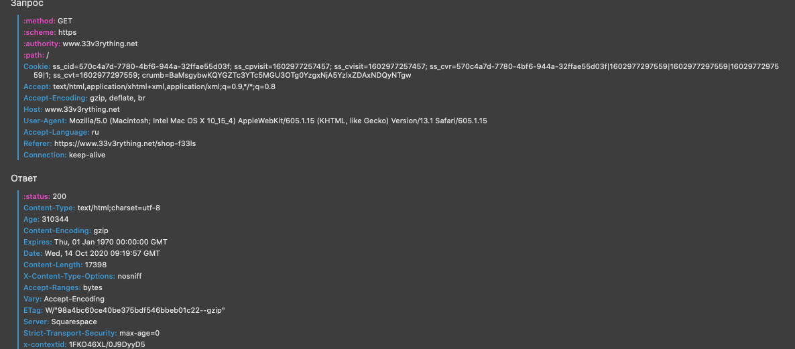
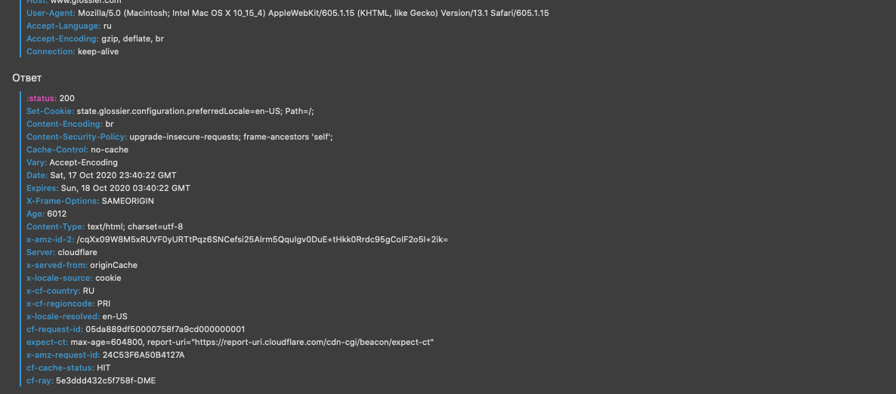
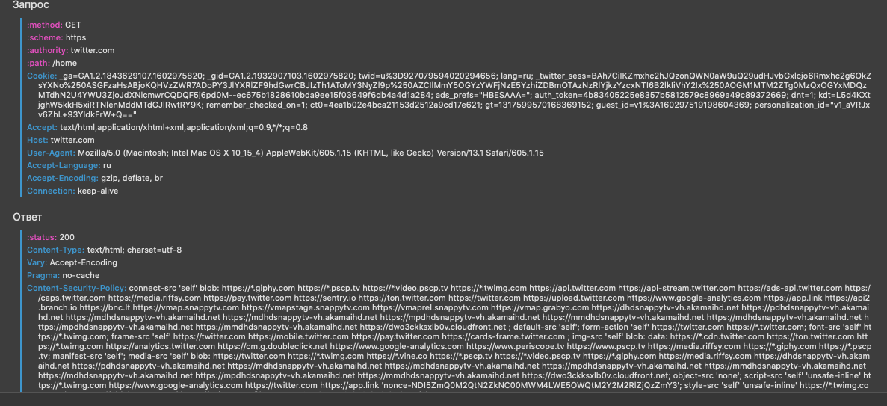
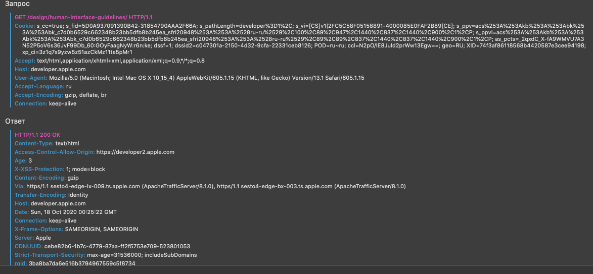

 Hello everyone! Today I'm going to analyze HTTP requests and responses for one of my favourite class at uni. 
 Let's go!

##### 33v3rything.net :turtle:

  My browser updated the page with GET-method as usual. I don't see anything unusual in the results that I got except few things only. In response there is 'Expire' header which contains the date / time after which the server response is considered outdated. It is showing 'Thu, 01 Jan 1970 00:00:00 GMT' for some mistirious reasons. Ususaly there is today's date in this header.
 
 ##### glossier.com :peach:
 
 The request section was too big because Set-cookie header conrains a lot of stuff. Also Cache-control header says 'no-cache', that seemed weird, although many websites I visited before had usually 'which max-age = 0' already written there.
 
 ##### twitter.com :earth_americas:
 
  Content-Security-Policy section is quite big. No wonder why...
 
 ##### tumblr.com :mountain_snow:
 
 That was the firts time I saw a X-Frame-Option HTTP response header which can be used to indicate whether or not a browser should be allowed to render a page. Sites can use this to avoid click-jacking attacks, by ensuring that their content is not embedded into other sites.The added security is provided only if the user accessing the document is using a browser that supports X-Frame-Options.
 
 ##### developer.apple.com :house_with_garden:
 
 Nothing unusual
 
 
 
